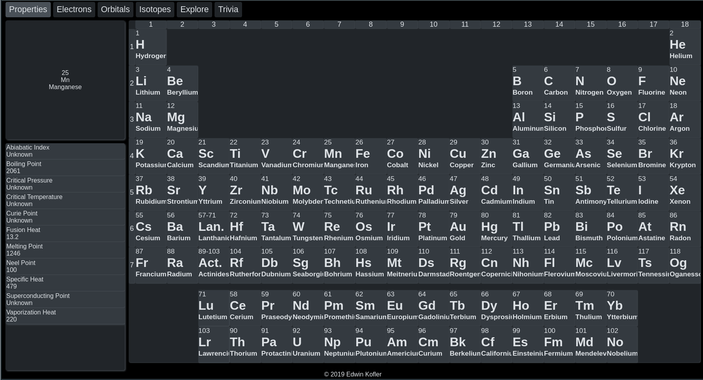

# Periodic Table Version 2

Same project goals as Periodic Table Version 1. Rewritten because I've learned a lot since starting the first version.

## Archive

Archived in favor of updating and improving the initial verison, which is closer to completion.

## Archive 2

The frontend and backend have been modified so the project still builds. See `./Bakefile.sh` for details

### Preview

## Roadmap (Short-Term)

- Fix whitespace in main periodic table (make it look nicer)
- Have highlighting of elements
  - Pass currently highlighted column to state and have a watcher that highlights all other atoms accordingly

## Roadmap (Long-Term)

- Run the theme files against program, checking their schema

### Future Optimizations

- Function calls in atoms re called on hover of not element-inner or element-outer, but the 
 tags inside element-inner. So even when moving around a single element, calls to udpateAtomData are still being made
